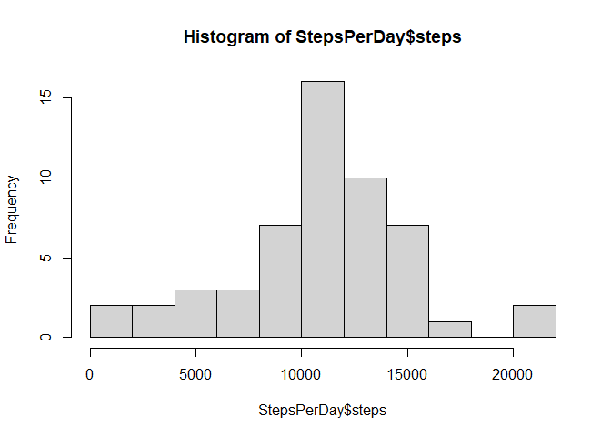
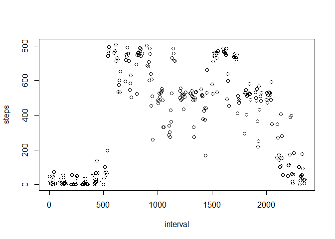
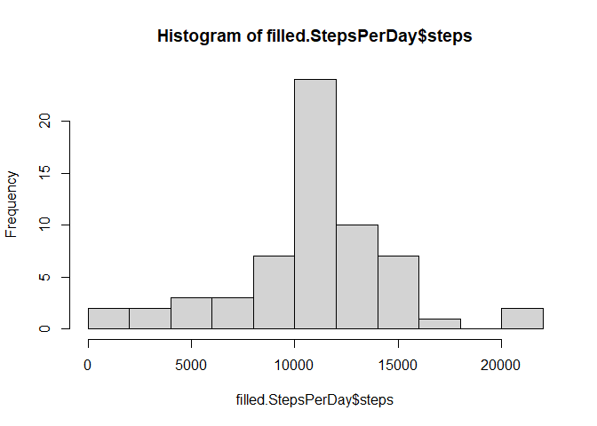
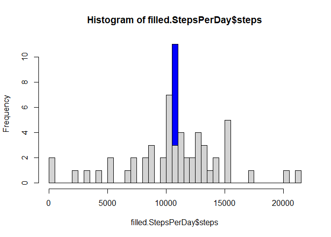
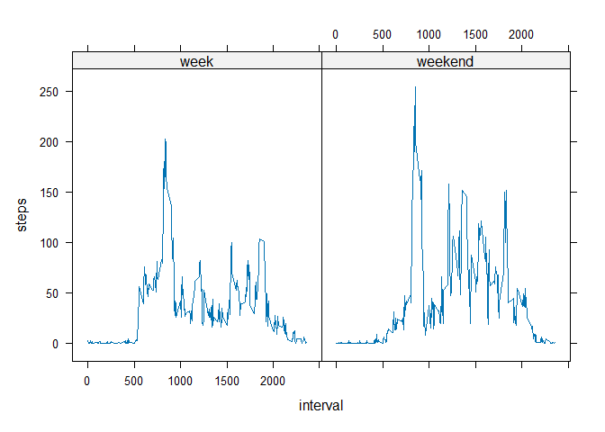

## Data

The data for this assignment can be downloaded from the course web
site: - Dataset: Activity monitoring data [52K] The variables included
in this dataset are: \* steps: Number of steps taking in a 5-minute
interval (missing values are coded as NA \* date: The date on which the
measurement was taken in YYYY-MM-DD format \* interval: Identifier for
the 5-minute interval in which measurement was taken The dataset is
stored in a comma-separated-value (CSV) file and there are a total of
17,568 observations in this dataset.

## Loading and preprocessing the data

We're going to use libraries dplyr and ... library(dplyr)

Download, unzip and load the data file into a data frame:


```r
# download dataset
if (!file.exists("activity.zip")) 
{
    message("Downloading dataset") 
    download.file("https://d396qusza40orc.cloudfront.net/repdata%2Fdata%2Factivity.zip", 
    destfile = "./Data/activity.zip", 
    method = "auto",
    mode = "wb")
}  
```

```
## Downloading dataset
```

```r
# unzip dataset 
if (!file.exists("activity.csv")) 
{
    message("Extracting dataset")
    unzip("./Data/activity.zip", 
          overwrite = FALSE, 
          exdir = "./Data")
}
```

```
## Extracting dataset
```

```
## Warning in unzip("./Data/activity.zip", overwrite = FALSE, exdir = "./Data"):
## not overwriting file './Data/activity.csv
```

```r
# read data in R
activity<-read.csv("./Data/activity.csv")
#store dates as date fields
dt<-as.POSIXct(activity$date)
activity[,2]<-dt
```

## What is mean total number of steps taken per day?

1.  Make a histogram of the total number of steps taken each day

First we aggregate the data per day:


```r
StepsPerDay <- aggregate(steps~date,activity,sum,na.rm=TRUE)
```

then we make the histogram


```r
#make histogram
hist(StepsPerDay$steps,breaks=10)
```

<!-- -->

2.  Calculate and report the mean and median total number of steps taken
    per day


```r
meansteps<-mean(StepsPerDay$steps,na.rm=TRUE)
mediansteps<-median(StepsPerDay$steps,na.rm=TRUE)
```
The mean number of steps per day is 10766.19.
The median number of steps per day is 10765.

## What is the average daily activity pattern?

1. Make a time series plot (i.e. type = "l") of the 5-minute interval (x-axis)
and the average number of steps taken, averaged across all days (y-axis)


```r
avg<-aggregate(steps~interval,activity,mean,na.rm=TRUE)
plot(avg,type="l")
```

<!-- -->

2. Which 5-minute interval, on average across all the days in the dataset,
contains the maximum number of steps?

```r
StepsPerInterval<-aggregate(steps~interval,activity,max,na.rm=TRUE)
which.max(StepsPerInterval$steps)
```

```
## [1] 76
```

```r
#plotting to verify whether this can be the correct answer
plot(StepsPerInterval)
```

<!-- -->
Answer: the 76th interval.

## Imputing missing values

Note that there are a number of days/intervals where there are missing values
(coded as NA). The presence of missing days may introduce bias into some
calculations or summaries of the data.
1. Calculate and report the total number of missing values in the dataset
(i.e. the total number of rows with NAs)


```r
# count the nr of missing values for the steps column. The dates & interval column always have values.
sum(is.na(activity$steps))
```

```
## [1] 2304
```


2. Devise a strategy for filling in all of the missing values in the dataset. The strategy does not need to be sophisticated. For example, you could use
the mean/median for that day, or the mean for that 5-minute interval, etc.

```r
# we will define a function that fills each missing value with the mean for that 5-minute interval across all days
# first calculate the mean number of steps per interval across all days
meanStepsPerInterval<-aggregate(steps~interval,activity,mean,na.rm=TRUE)
#then write the function
fill.value<-function(step,interval){
    filled<-NA
if(!is.na(step))
    filled<-c(step)
else filled<-meanStepsPerInterval[meanStepsPerInterval$interval==interval,2]
return(filled)
}
```


3. Create a new dataset that is equal to the original dataset but with the
missing data filled in.

```r
#create a new dataset, starting from the original one
filled.activity <- activity
filled.activity$steps <- mapply(fill.value, filled.activity$steps, filled.activity$interval)
```


4. Make a histogram of the total number of steps taken each day and Calculate
and report the mean and median total number of steps taken per day. Do
these values differ from the estimates from the first part of the assignment?
What is the impact of imputing missing data on the estimates of the total
daily number of steps?


```r
filled.StepsPerDay <- aggregate(steps~date,filled.activity,sum,na.rm=TRUE)

#make histogram
hist(filled.StepsPerDay$steps,breaks=10)
```

<!-- -->

```r
mean.filled.steps<-mean(StepsPerDay$steps,na.rm=TRUE)
mean.filled.steps
```

```
## [1] 10766.19
```

```r
median.filled.steps<-median(StepsPerDay$steps,na.rm=TRUE)
median.filled.steps
```

```
## [1] 10765
```
At first sight, the impact of imputing the missing data is none.
But this cannot be correct, as we added steps, so the number of steps for each day with originally missing data should have gone up.
Plotting the 2 histograms in the same graph, with more granularity.
The blue ones are the filled data, grey is the original data (shown on top).

```r
 hist(filled.StepsPerDay$steps,col='blue',breaks=50)
    hist(StepsPerDay$steps,breaks=50,add=TRUE)
```

<!-- -->

Imputing the data only affected the number of occurrences of a very particular task count, i.e. the median one. This because the missing values were mainly linked to a few dates, for which there was hardly any value.


## Are there differences in activity patterns between weekdays and weekends?

For this part the weekdays() function may be of some help here. Use the dataset
with the filled-in missing values for this part.

1. Create a new factor variable in the dataset with two levels – “weekday”
and “weekend” indicating whether a given date is a weekday or weekend
day.


```r
   library(lubridate)
```

```
## 
## Attaching package: 'lubridate'
```

```
## The following objects are masked from 'package:base':
## 
##     date, intersect, setdiff, union
```

```r
    # create a function to determine whether a day is a weekday or not (weekornot)
    weekornot<-function(day){
        weekornot<-NA
        if (wday(day)<6) weekornot<-"week"
    else weekornot<-"weekend"
    return(weekornot)
    }
    #apply this function to each date and store the result in a new column, called 'weekdays'
    filled.activity$weekdays <- sapply(filled.activity$date, weekornot)
```


2. Make a panel plot containing a time series plot (i.e. type = "l") of the
5-minute interval (x-axis) and the average number of steps taken, averaged
across all weekday days or weekend days (y-axis).


```r
library(lattice)    
avg_steps_weekornot <- aggregate(steps ~ interval + weekdays, data = filled.activity, mean)
    xyplot(steps~interval|weekdays,avg_steps_weekornot,type="l")
```

<!-- -->

